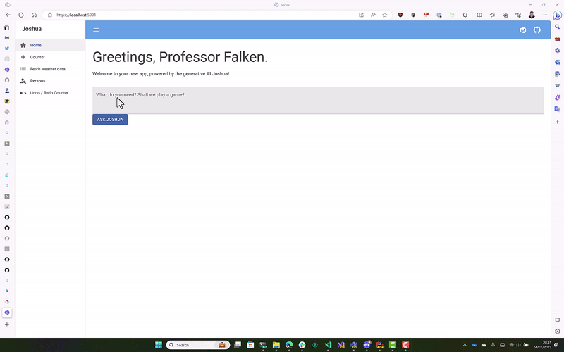

# SemanticKernel
Packages, Examples and Demo code for Semantic Kernel

## [Thinktecture SemanticKernel BlazorNavigationPlugin](./src/Thinktecture.SemanticKernel.BlazorNavigationPlugin/docs/README.md)

This plugin can be easily installed as a NuGet package into your Blazor application. After registration and adding it
to your SemanticKernel, it is able to navigate your Blazor application. It works best if you provide additional
`[Description]`-attributes to all your Blazor pages so that the model knows what your application can do.

See [SemanticKernel Blazor Navigation Plugin](./src/Thinktecture.SemanticKernel.BlazorNavigationPlugin/docs/README.md)

